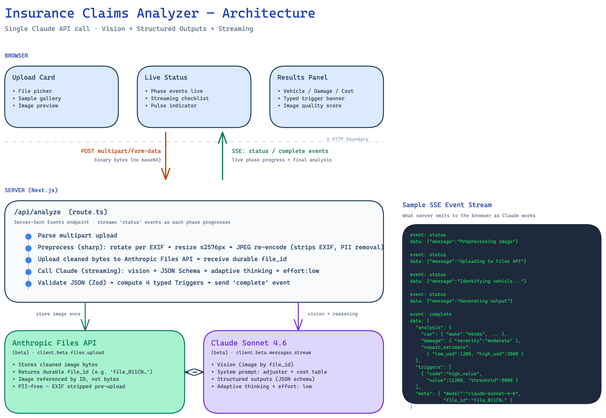

# Insurance Claims Analyzer (Prototype)

AI-powered prototype for an auto insurance claims workflow. Upload (or paste a URL of) a photo of a damaged vehicle and receive a structured assessment: vehicle metadata, damage description with severity, and a repair-cost range grounded in live web data — with explicit confidence indicators on every output.

Built as a take-home prototype on a 3–4 hour budget. Single Anthropic Claude API call drives the entire AI pipeline.

---

## Quick start

```bash
# 1. Install deps (Node 20+ required)
npm install

# 2. Add your Anthropic API key
cp .env.local.example .env.local
# then edit .env.local and paste your sk-ant-... key

# 3. Run the dev server
npm run dev
```

Open <http://localhost:3000>. Click a sample image, or upload your own.

Each analysis takes ~5–10 seconds end-to-end. The UI streams progress events live so the wait feels active rather than blocked.

---

## Design Explanation

This section is a focused answer to the three required sub-bullets of the take-home brief: why these tools, how the AI logic works, and what would change with more time.

### Why these tools

**Next.js (App Router) + TypeScript + Tailwind** in a single repo, because the spec demands a working full-stack demo in 3–4 hours. Next.js gives me one codebase, one dev command, and one test surface — no client/server split to maintain. Tailwind keeps styling decisions out of the critical path.

**Anthropic Claude (Sonnet 4.6) as the *only* AI service**, because the entire pipeline — vehicle identification, damage classification, cost estimation — fits inside a single API call when you combine vision, structured outputs, and adaptive thinking. No model chaining, no glue code, one provider in the architecture diagram. This is the most impactful design decision in the prototype: every other choice flows from it.

**Anthropic Files API** for image storage, so I avoid introducing S3 / Vercel Blob and the associated CORS / presigned-URL plumbing for a 4-hour build. The `file_id` is a durable handle that sets up the multi-step workflows in Phase 2 (reanalysis, before/after comparison, fraud signals) without an architectural pivot.

**`sharp` for image preprocessing** (resize ≤ 2576 px, JPEG re-encode, EXIF strip) — runs at the server edge before the image hits Anthropic's storage. The EXIF strip is real PII removal: GPS coordinates, timestamps, device info. **`zod`** for runtime schema validation of Claude's structured output, so the frontend never has to defensively parse model responses.

→ Full breakdown in [Architecture overview → Tech stack](#tech-stack) and [Design decisions](#design-decisions).

### How the AI logic works

A single `client.beta.messages.stream()` call drives everything. The image (referenced by `file_id` from the Files API upload) goes into a multimodal message alongside an instruction to analyze. The model is steered by a **system prompt that frames Claude as an experienced auto damage adjuster** with a five-step playbook (identify vehicle → describe damage → estimate cost → score image quality → flag for review). The system prompt also inlines a **typical-cost reference table** by damage type and vehicle tier, so Claude's cost estimates are anchored in industry-typical ranges.

`output_config.format` enforces a **JSON schema on the response** — the shape is guaranteed at the API level, no parsing flakiness possible. **Adaptive thinking with `effort: "low"`** lets Claude reason as deeply as it needs to but stay tuned for fast first-pass assessment. The endpoint is a **Server-Sent Events stream**, so the user sees each phase appear live (preprocessing → upload → vehicle ID → output generation) — total wall-clock is ~5–10 seconds, but it feels instant.

After Claude returns, the server **validates the JSON with Zod**, then runs four deterministic rules to compute typed `Trigger[]` objects (low confidence, severe damage, poor image quality, high-value claim). These are the human-review escalation signals — the AI's self-assessment is a fallback; the typed triggers are the source of truth. Each trigger carries a `code` for routing, the actual `value`, and the `threshold` that tripped — machine-readable and auditable.

→ Full step-by-step in [How the AI logic works](#how-the-ai-logic-works).

### Potential improvements

The full roadmap is in [SOW.md](./SOW.md) as five phases. Highlights:

- **Persistence + audit log** (Phase 1): Postgres for claim records, S3 + KMS for images with 7-year retention, full read/write audit trail with the Claude model version captured for every analysis.
- **Production cost integration** (Phase 1.5): replace the in-prompt reference table with **Mitchell / CCC ONE / Audatex APIs** for parts-level pricing — this is the actual stack every major US carrier uses.
- **Multi-image and comparison flows** (Phase 2): multi-angle upload, side-by-side and AI-powered before/after comparison for repair verification. Introduces an **interactive adjuster co-pilot built on Anthropic's Managed Agents API** — persistent stateful sessions per claim where adjusters can reanalyze, generate PDF/DOCX claim documents, and iteratively refine the assessment.
- **Fraud signals** (Phase 3): image-hash deduplication, visual-similarity scoring against historical claims, AI pairwise comparison on top suspects.
- **PII redaction pipeline** (Phase 1+): automatic license-plate and face redaction before storage, configurable retention with archival, full SOC 2 / GDPR-equivalent audit logging.
- **VIN sticker detection with NHTSA cross-reference**: fraud signal when claimed make/model ≠ VIN-decoded.
- **Self-consistency sampling on low-confidence cases**: re-run on the same image, flag estimate variance.
- **Cross-model verification on >$10k claims**: run Sonnet 4.6 + Opus 4.7, flag disagreement on severity/cost.
- **Real claims-system integration**: Guidewire / Duck Creek webhook to push assessments and pull claim status.

---

## Architecture overview



The frontend opens an SSE connection and the API streams `status` events as each phase progresses (preprocessing → upload → vehicle ID → output generation), then a final `complete` event with the structured analysis. Total wall-clock time: ~5–10 seconds.

Source diagram (editable at <https://excalidraw.com>): [`architecture.excalidraw`](./architecture.excalidraw). To re-render after editing:

```bash
cd ~/.claude/skills/excalidraw-diagram/references
uv run python render_excalidraw.py path/to/claims-prototype/architecture.excalidraw --scale 2 --width 1600
```

### Tech stack

| Layer            | Choice                                               | Why                                                                             |
| ---------------- | ---------------------------------------------------- | ------------------------------------------------------------------------------- |
| Framework        | Next.js 16 (App Router) + TypeScript                 | Single repo for full-stack, runs locally with one command                       |
| AI               | `@anthropic-ai/sdk` + `claude-sonnet-4-6`            | Vision + structured outputs + adaptive thinking + streaming in one API call     |
| Image storage    | Anthropic Files API (beta)                           | Native to Claude; no extra buckets/CORS/auth to wire up                         |
| Image processing | `sharp`                                              | Resize and strip EXIF metadata (PII removal)                                    |
| Schema           | `zod` + hand-written JSON Schema                     | Server-side validation of model output; shared TS types between client/server   |
| Styling          | Tailwind CSS 4                                       | Fastest path to a polished UI                                                   |

---

## How the AI logic works

The whole AI pipeline is a single `client.beta.messages.create()` call. There is no chained model orchestration — Claude does everything.

### 1. The system prompt (`lib/system-prompt.ts`)

Frames Claude as an experienced auto damage adjuster with a five-step playbook:

1. Identify the vehicle (with per-field confidence)
2. Describe the damage (per-area, with severity)
3. Estimate repair cost — anchored in the inlined reference table + Claude's prior knowledge of typical auto-body repair costs
4. Score image quality (which caps confidence)
5. Flag for human review when confidence is low or stakes are high

The prompt also inlines a typical-cost reference table (`lib/damage-priors.ts`) covering bumper / panel / glass / light replacements at three vehicle tiers (economy / midrange / luxury). This anchors Claude's estimate in industry-typical ranges. Production would replace the reference table with Mitchell / CCC ONE / Audatex APIs for parts-level pricing.

### 2. Structured outputs (`lib/schema.ts`)

`output_config.format` with a JSON Schema guarantees the response shape. The frontend never has to defensively parse — every field is present and typed:

```
{
  car: {make, model, color, year_estimate, field_confidences{make/model/color/year}, confidence_reasoning},
  damage: {summary, affected_areas[{location, damage_type, area_confidence}], severity, severity_confidence, confidence_reasoning},
  repair_estimate: {low_usd, high_usd, confidence, reasoning, sources[]},
  image_quality: {score, issues[]},
  requires_human_review: boolean,
  review_triggers: [],
  analysis_notes: string
}
```

### 3. Streaming UX

The API route (`app/api/analyze/route.ts`) is a Server-Sent Events endpoint. As Claude works, the server emits `status` events for each phase (preprocessing → upload → vehicle ID → output generation), then a final `complete` event with the structured analysis. The frontend renders phases live: each completed step gets a checkmark, the current step pulses with a blue dot. Total wall-clock time is ~5–10 seconds, but the streaming makes the wait feel active rather than blocked.

### 4. Adaptive thinking + image preprocessing

- **Adaptive thinking + `effort: "low"`** — Claude reasons as deeply as needed but with effort tuned for fast first-pass assessment. Increase to `"medium"` or `"high"` for higher-stakes claims.
- **Image preprocessing** (`lib/preprocess.ts`) resizes inputs to ≤ 2576 px and **strips EXIF metadata before upload**, removing GPS coordinates, timestamps, and device info that would otherwise persist in Anthropic's Files API (PII compliance).

### 5. Confidence and human-review routing

Every output carries a numerical 0–100 confidence. The model itself decides `requires_human_review = true` when **any one** of the following triggers fires:

| # | Trigger | Threshold |
|---|---|---|
| 1 | Low confidence on any field | Any individual confidence < 30 |
| 2 | Severe damage classification | `severity == "severe"` |
| 3 | Poor image quality | Image quality score < 50 |
| 4 | High-value repair | `high_usd > $9,000` |

**Triggers are typed objects, computed server-side.** `lib/schema.ts` exports `computeTriggers(analysis)` which produces a `Trigger[]` from Claude's output:

```typescript
type Trigger =
  | { code: "low_confidence"; field: string; value: number; threshold: number; label: string }
  | { code: "severe_damage"; label: string }
  | { code: "poor_image_quality"; value: number; threshold: number; label: string }
  | { code: "high_value"; value: number; threshold: number; label: string };
```

Each trigger carries the `code` (for routing/filtering downstream), the actual `value` and `threshold` that tripped the rule, and a human-readable `label`. The UI uses `code` to render a tag pill ("Low confidence", "High-value claim") plus the label as the explanation.

**Why server-side instead of model-driven?** Two reasons:
1. **Bulletproof enforcement** — the four mechanical rules (confidence, severity, image quality, dollar value) execute deterministically regardless of how Claude phrases its self-assessment.
2. **Typed downstream consumption** — fraud routing, queue assignment, audit logs, and analytics can act on `code` and `value` without parsing prose strings.

**Thresholds are configurable in `lib/schema.ts`** (the `REVIEW_THRESHOLDS` constant). Different carriers will have different risk appetites — a conservative carrier might raise the confidence threshold to 70; an aggressive automation strategy might raise the high-value threshold to $20,000. This is the per-carrier tuning surface in production.

---

## How images are processed

The image traverses **five stages** from the user's hard drive to Claude's vision system. The middle stage (server-side preprocessing) is where the meaningful work happens — PII removal and dimension capping before any external service sees the bytes.

```
  Browser file pick  →  multipart upload  →  sharp pipeline  →  Files API  →  Claude vision
   (File object)        (FormData POST)      (server-side)      (file_id)     (by reference)
```

### Stage 1 — File selection (browser)

`components/UploadCard.tsx` handles two entry points and converges them on the same code path:

- **Picked file**: `<input type="file">` → `handleFileChange()` puts the `File` in component state and creates a `blob:` URL for the local preview (no upload yet).
- **Sample image**: `handleSampleClick()` fetches the local `/samples/*.jpg`, wraps the blob as a `new File([blob], filename)`, and submits it as if the user had picked it. This means **samples and uploads share the exact same server-side path** — one validation surface.

### Stage 2 — Multipart upload (browser → server)

`app/page.tsx` builds `FormData` and POSTs to `/api/analyze`:

```typescript
const fd = new FormData();
fd.append("file", input.file);
const response = await fetch("/api/analyze", { method: "POST", body: fd });
```

`FormData` + native `fetch` sends the file as `multipart/form-data` — **binary bytes over the wire, no base64 encoding overhead**.

### Stage 3 — Extract bytes from the request (server)

`app/api/analyze/route.ts` parses the multipart body using the Web Standards `Request.formData()` API, extracts the file under the `"file"` key, and converts it to a Node `Buffer`:

```typescript
const formData = await request.formData();
const file = formData.get("file");
if (!(file instanceof File)) {
  return Response.json({ error: "No file uploaded" }, { status: 400 });
}
const imageBuffer = Buffer.from(await file.arrayBuffer());
```

Validation errors return as **JSON 4xx responses, not in-stream errors** — by design, the SSE stream isn't even opened until input is valid.

### Stage 4 — `sharp` preprocessing pipeline (server)

This is the most interesting stage. `lib/preprocess.ts` chains three transformations in one pipeline, **and the order matters**:

```typescript
sharp(input)
  .rotate()                                          // 1. apply EXIF orientation
  .resize({ width: 2576, height: 2576,
            fit: "inside", withoutEnlargement: true })  // 2. cap dimensions
  .jpeg({ quality: 90, mozjpeg: true })              // 3. re-encode (drops EXIF)
```

| Step | What it does | Why this order |
|---|---|---|
| `.rotate()` | With no argument, sharp auto-rotates per the image's EXIF orientation tag. Phones often store images in landscape with an "orientation: 6" flag meaning "display rotated 90°". | Must run **before** EXIF strip — otherwise the orientation tag is gone and Claude sees the image sideways. |
| `.resize({ fit: "inside", withoutEnlargement: true })` | Scales the image so the longer edge ≤ 2576 px, preserving aspect ratio, never upscaling smaller images. | Caps vision-token cost without losing fidelity. 2576 px is Claude's vision input ceiling. |
| `.jpeg({ quality: 90, mozjpeg })` | Re-encodes to JPEG with no metadata. **All EXIF is dropped** — no GPS coordinates, no camera model, no timestamp, no device serial. | This is the **PII removal** step. `mozjpeg` saves ~10% additional compression at the same quality. |

The PII concern is real. A claimant's phone photo could otherwise leak:

- **GPS lat/long** — where the photo was taken (could contradict claimed location)
- **Timestamp** — when it was taken (could contradict claimed incident date)
- **Device fingerprint** — model, serial number, software version

Stripping at the edge before the image hits the Files API means Anthropic never stores the metadata.

### Stage 5 — Anthropic Files API + Claude vision (external)

Two API calls to Anthropic, in order:

```typescript
// 5a. Upload bytes once → get a durable file_id
const uploaded = await anthropic.beta.files.upload({
  file: await toFile(processed.buffer, processed.filename, { type: processed.mimeType }),
  betas: ["files-api-2025-04-14"],
});

// 5b. Reference by file_id in the Claude call (bytes don't get re-sent)
content: [
  { type: "image", source: { type: "file", file_id: uploaded.id } },
  { type: "text", text: "Analyze this damaged vehicle photo..." }
]
```

The bytes go to Anthropic **once**. Every subsequent reference is by `file_id`. This unlocks the multi-step Phase 2 workflows (reanalysis, before/after comparison, fraud signals) without an architectural change — the image is already there, durably stored.

### What ends up where

| Step | Image state | Size (typical) | Stored where |
|---|---|---|---|
| 1. User pick | Original phone JPEG with full EXIF | 4–8 MB | Browser memory |
| 2. POST | Original bytes over the wire | 4–8 MB transferred | In flight |
| 3. Buffer | Same bytes in Node | 4–8 MB | Server memory |
| 4. After sharp | Resized JPEG, no EXIF | ~400–800 KB | Server memory |
| 5a. Files API | Cleaned bytes uploaded | ~400–800 KB | Anthropic Files storage |
| 5b. Claude call | Reference by `file_id` only | ~30 bytes (just the ID) | In the request payload |

The sharp pipeline cleans the image **before** any external service sees it. PII is stripped in stage 4; only the cleaned bytes ever reach Anthropic.

---

## Project structure

```
claims-prototype/
├── app/
│   ├── page.tsx                 # Single-page UI (state machine: idle/analyzing/done/error)
│   ├── layout.tsx               # Root layout (default Next.js)
│   └── api/analyze/route.ts     # The one API route — all backend logic
├── components/
│   ├── UploadCard.tsx           # File picker + URL input + sample gallery
│   ├── ResultsPanel.tsx         # Three result cards + human-review banner
│   ├── ConfidenceBadge.tsx      # Color-coded numerical confidence pill
│   └── SeverityBadge.tsx        # Minor/Moderate/Severe pill
├── lib/
│   ├── anthropic.ts             # Lazily-instantiated Claude client
│   ├── schema.ts                # Zod schema + JSON Schema for structured outputs
│   ├── system-prompt.ts         # Auto-adjuster persona + reasoning playbook
│   ├── damage-priors.ts         # Reference cost table (sanity prior)
│   └── preprocess.ts            # sharp pipeline + URL fetcher
├── .env.local.example
└── package.json
```

---

## Design decisions

| Decision                                       | Rationale                                                                                                                                                     |
| ---------------------------------------------- | ------------------------------------------------------------------------------------------------------------------------------------------------------------- |
| Claude as the **only** AI service              | One model handles vision + reasoning + tool use. No multi-model glue code; one provider to talk about with the customer.                                     |
| **Structured outputs** over regex JSON parsing | The contract is enforced by the API. The frontend never crashes on malformed model output.                                                                   |
| **In-prompt reference cost table**             | The cost estimate is the weakest part of any vision-based claims tool. An inlined typical-cost table by damage type × vehicle tier anchors Claude's estimate; production replaces this with Mitchell / CCC ONE / Audatex parts pricing (Phase 1.5). |
| **Anthropic Files API** for image storage      | Avoids introducing S3/Vercel Blob and the associated CORS / presigned-URL plumbing for a 4-hour build. The `file_id` becomes the durable handle to the image. |
| **Per-field numerical confidence**             | "Make: 95%, Year: 60%" is more useful to an adjuster than a single overall confidence — and reflects the real asymmetry (year is harder than make).          |
| **Image preprocessing before upload**          | EXIF stripping is a real PII concern (GPS / device / timestamp). Resizing to ≤ 2576 px caps cost without losing fidelity Claude can use.                     |
| **No database in the prototype**               | The original spec doesn't require persistence. Adding it costs hours and isn't visible in the demo. Phase 2 in the SOW.                                      |
| **Local-only run, no deployment**              | The assignment explicitly allows local demos. Removes deploy debugging from the build budget.                                                                |

---

## Potential improvements (future work)

The SOW (`SOW.md`) lays out the roadmap as Phase 1 → Phase 4. In short:

1. **Pilot launch** (Phase 1, 8 weeks) — hosted multi-tenant app, carrier SSO, persistence (Postgres + S3 with KMS, 7-year retention), audit log capturing the model version per analysis, CV-based PII redaction (license plates + faces), and claims-system integration (Guidewire / Duck Creek webhook). Cross-model verification on >$10k claims (Sonnet 4.6 + Opus 4.7, flag disagreement) ships in this phase.
2. **Production cost integration + bulk reprocessing** (Phase 1.5, 4 weeks) — replace the in-prompt reference table with Mitchell / CCC ONE / Audatex APIs for parts-level pricing. Operationalize the Anthropic Messages Batches API for non-latency-sensitive workloads (model-upgrade reanalysis, fraud backfill, compliance audits) at 50% of synchronous-API cost.
3. **Multi-image flows + adjuster co-pilot** (Phase 2, 6 weeks) — multi-angle upload, side-by-side and AI-powered before/after comparison for repair verification. Interactive adjuster co-pilot built on Anthropic's Managed Agents API — persistent stateful sessions per claim with PDF/DOCX claim-document generation.
4. **Fraud-signal pipeline** (Phase 3, 8 weeks) — image-hash dedup, visual-similarity scoring against historical claims, AI pairwise comparison on top suspects. Long-running investigations run as Managed Agents sessions with custom tools that pull related claims and produce structured fraud reports for SIU review.
5. **National rollout + multi-carrier** (Phase 4, ongoing) — hardening, SLA tuning, observability, additional carrier onboarding, mobile-first UX refinements.

Smaller tactical improvements (outside the SOW phases, could fit inside any of them):

- Self-consistency sampling for low-confidence cases (re-run on the same image, flag estimate variance).
- VIN sticker detection in dashboard photos with NHTSA vPIC cross-reference (fraud signal when claimed make/model ≠ VIN-decoded). Risk-assessment mitigation in the SOW; could ship inside Phase 2.
- Haiku 4.5 fallback path for low-stakes claims (<$2k) — ~5× per-claim cost reduction with confidence-routed escalation back to Sonnet on low-confidence outputs.

### Orchestration strategy past the POC

The Phase 0 prototype is a single `messages.create()` call. Production keeps that single-call architecture as the **default spine** — it handles the majority of claims correctly with one round-trip, one schema, and one transaction boundary — and layers **chained model orchestration** on top only as gated specializations where a specific failure mode or cost dynamic justifies the extra inference. Six chained patterns ship across Phases 1–3 (full table in `SOW.md`):

| Phase | Chain pattern              | Trigger                           | What chains                                                             |
| ----- | -------------------------- | --------------------------------- | ----------------------------------------------------------------------- |
| 1     | Cross-validation           | `high_usd > $10k`                 | Sonnet 4.6 + Opus 4.7 in parallel → comparison                          |
| 1     | Self-consistency sampling  | Any field confidence < threshold  | Re-run Sonnet → variance comparison                                     |
| 1.5   | Haiku triage tier          | All claims (only ungated chain)   | Haiku 4.5 triage → Sonnet on pass; cuts blended cost ~30%               |
| 1.5   | Parts-pricing fusion       | Damage assessment complete        | Sonnet damage → Mitchell/CCC parts API → Sonnet cost grounding          |
| 2     | Adjuster co-pilot          | Adjuster opens claim console      | Anthropic Managed Agents API — chained tool/model loop in a session     |
| 3     | Fraud pipeline             | Suspect-similarity above threshold | Hash dedup → vector similarity → AI pairwise → structured fraud report |

**Design rule:** every chain ships with a named failure mode, measured baseline error rate, trigger condition that gates it to a subset of traffic, and an A/B-validated metric move versus single-call. Chains that don't earn their keep get removed in quarterly review.

**Explicitly out of scope:** splitting the single-call assessment into vehicle-ID → damage → cost stages (adaptive thinking already does that internally), and generic "verifier" stages without a named failure mode (two calls of the same model on the same input mostly agree with themselves — 2× cost for no real signal).

---

## Running and testing

```bash
npm run dev      # dev server on :3000
npm run build    # production build (validates types + builds output)
npm run lint     # ESLint
npx tsc --noEmit # TypeScript type-check
```

### Demo tips

- The bundled sample images (in `components/UploadCard.tsx`) are fast paths to a reliable demo — clicking one immediately runs an analysis without needing a local image file.
- First request takes longer because the JSON Schema is compiled server-side; subsequent identical-schema requests are faster (24-hour schema cache).
- The "Human Review Recommended" banner appears when the model flags low confidence — a great moment to highlight that the AI knows what it doesn't know.
- The cost-estimate "Sources" section shows the citations Claude relied on (reference-table tier, industry knowledge). This is the auditability story for the insurance customer.

### Limitations to be honest about in the demo

- The cost estimate is AI-generated. It's grounded in an in-prompt reference table by damage type × vehicle tier; for production it needs to integrate with Mitchell / CCC / Audatex.
- The model can misidentify uncommon vehicles or damage hidden behind angle/lighting. The image-quality score and confidence flags are designed to surface this honestly rather than mask it.
- No persistence: refreshing the page loses the analysis. Intentional for a prototype; covered in SOW Phase 1.

---

## License

Take-home prototype — provided as-is for review purposes.
